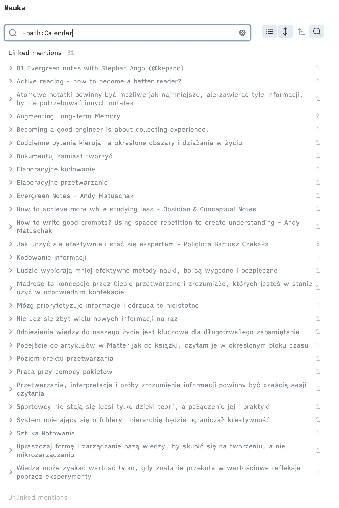

In the [previous article](/writing/how-i-use-obsidian-to-manage-mental-overload-in-fast-paced-tech-world), I described how using Obsidian helps me manage information overload and work more effectively. But a note is only useful if you can find it again weeks later.

Today I'll share how I structure my note system.

The effectiveness of a note-taking system is measured by one thing: how quickly and easily you can locate a note weeks later. This is why I strive to create a system that serves as a "cache" of knowledge, enabling me to find solutions to problems more efficiently.

I use the following principles to maintain an effective yet simple system:

1. Write notes as messages to my future self.
2. Focus on connections instead of hierarchy (see "Connections, tags and folders" below).

## Write notes as messages to my future self

To efficiently find and reuse information, I write notes from my future self's perspective—considering how I will retrieve them. Spending a few extra seconds to answer the questions below saves much more time later.

- What contexts will help me find this note: a project, technology, person, or team?
- Why will I need this note in a few weeks, and in which situation will it speed up my work?

### Engineering problems and solutions: building hub notes

Most of my notes capture engineering problems and the solutions I found. For example, the first time I used `jest-e2e` (an internal tool for running E2E tests), I struggled to understand why a test had failed.  I spent an hour trying to figure it out, only to discover that a missing feature flag setting was causing the wrong branch to run. 

To prevent wasting time on this issue again, I created a note titled _"If E2E is broken, be sure the right Feature Flag is set up"_ to describe the problem and the solution. I linked this note to others titled _"Jest-E2E"_ and _"Feature Flag"_.

Another example is a tricky bug related to [Relay](https://relay.dev/), where the cache was misused. To identify the root cause, I had to dive deep for a few hours, as it initially seemed like caching was the obvious issue. The correct solution turned out to be refreshing multiple connections. 

After fixing the bug, I wanted to ensure I left **a guide for myself and others to navigate a similar process more efficiently in the future**. To accomplish this, I took detailed notes documenting the problem and solution, titled _"Relay allows refreshing multiple connections, use it instead of cache invalidation"_ and _"Be cautious with cache invalidation for Relay"_. I linked all of these notes to a central "Relay" reference for easy access.

Keywords like "Relay," "Jest-E2E," or "Feature Flag" serve as **conceptual notes**, grouping related insights, problems, and solutions around that concept.

So what is the benefit of this approach?

I can easily see all references to a particular keyword across my entire vault. When I next encounter a weird end-to-end test or Relay problem (or just want to explain these topics to others), I can easily access all related notes by visiting the hub note. The note itself can remain empty; the backlinks are what truly matter. 

### Projects and meetings

Similarly, you can create notes on a specific project or initiative to keep all related information in one place. For example, during a meeting you can quickly jot something down and add `[[ProjectX]]` to link it to the project. 

Obsidian allows you to filter backlinks; for example, you can narrow them down to meeting notes only (using the `#type/meeting` tag described below). This is especially useful for double-checking a decision made in "some meeting in the past" about Project X.

## Scaling the system with connections

A system based on connections is super easy to grow and scale organically. 

If you have a lot of notes about testing and feel you need better navigation, you can build an “abstraction” for it—another level. 

Link keyword notes to a more generic note like "Jest E2E" -> "Testing". This is still a link, not a folder, so one keyword note can sit under several generic notes at the same time. 

That way you can navigate these keyword notes top-down or bottom-up.

## Connections, tags and folders

Obsidian offers three ways to organize notes: connections, tags and folders. Here is how I use each of them—and why connections do most of the work.

Connections handle navigation, tags handle filtering, and folders exist mainly for tooling.

### Connections

My system relies on connections rather than strict hierarchy. A hierarchical structure requires everything to be in one place, but notes often cover several ideas, so a single note can belong to several keywords at once. Connecting a note to several keywords also makes it easier to find weeks later, because each connection is another path back to it.

For example, if I were to add a note about a certain decision made by "X" and "Y" related to "Project X" during "Meeting A," I would have four different starting points to reach it again: "X," "Y," "Project X," and "Meeting A." That makes the information much easier to find.

### Tags

If you think about a note as an object storing information, tags are the attributes describing that object (type, status, date). I use them on notes and on bullet points in daily notes as additional metadata to filter relevant information. Typical tags I use are `#type/meeting`, `#type/article`, ``#type/podcast`, `#flashcard`, `#todo`, `#💡``.

### Folders

I use folders mostly to integrate them with other systems, e.g., the terminal, iOS, Obsidian Sync, Readwise or Claude Code. 

As I mentioned, I avoid hierarchy and keep the folder structure as flat as possible. Thanks to connection-based organization and the advanced search offered by Obsidian, I don't feel the need for a more precise structure.

---

This connection-based system gives me confidence that I can store information safely and find it later. Writing notes for my future self and linking them through hubs instead of folders is what turns the vault into a real "cache" of knowledge. 

This system has helped me reduce information overload, and I hope these ideas help you create your own system.
