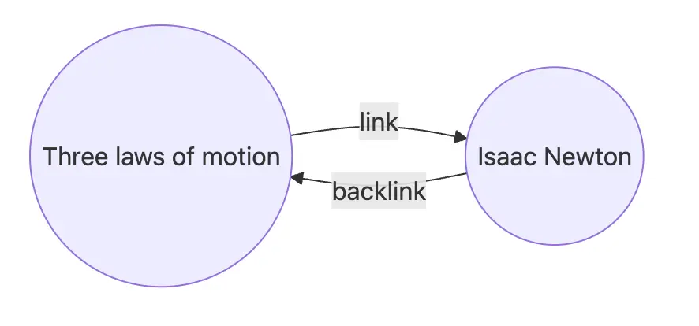
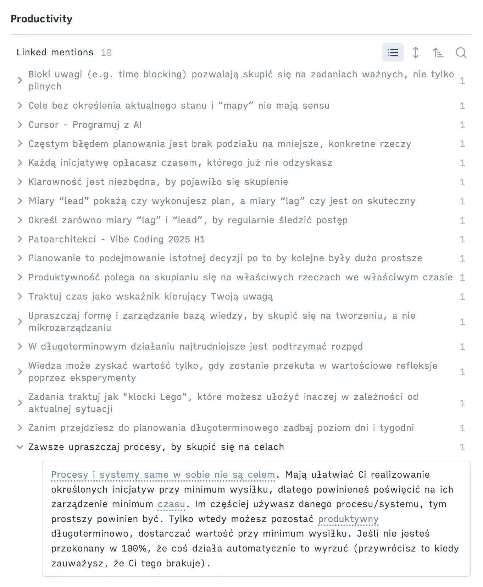

I’ve been working as a Software Engineer for almost a decade now. In the tech world, things move fast, and we’re constantly bombarded with more and more information. Too often, we tell ourselves, *“I’ll remember it”* or *“I’ll keep it in my head.”*

However, the reality is that our brains have a limited capacity for information.

## The brain is a CPU, not a storage disk

In the past, I often overestimated my ability to retain information. I typically managed to handle less than I thought I could. Whenever I exceeded this limit, I began to feel overwhelmed. This feeling of overwhelm hurt my focus, made it difficult for me to enter a flow state, and hindered my ability to move on to the next task. I also found myself procrastinating more.

That happened because our brains function like CPUs: they are designed to analyze information, make connections, and engage in creative thinking. 

When we overload them with too much information, we diminish their capacity for these crucial processes. And “too much” isn’t actually that much; we can manage about [seven “chunks” of information](https://bpb-us-e1.wpmucdn.com/wp.nyu.edu/dist/0/1503/files/2015/08/The_Magical_Number_Seven.pdf?bid=1503) in our minds at any given time.

Fortunately, there’s a simple way to help your brain and reduce overload - **an external storage system**.

## External storage system in Obsidian

I put literally everything in there.

- Have important tasks for the day? I place them at the top of my daily note, ensuring they’re always visible and helping me narrow my focus.
- Need to implement new functionality? I start by outlining a step-by-step plan. This practice consistently enhances the quality of my code and the abstractions I create—it’s like having a rubber duck to talk through my thoughts.
- Encounter a tricky spot or a hard-to-debug issue? I jot down a quick note to make sure I can reuse that information later. Think of it as the DRY (Don’t Repeat Yourself) principle applied to notes and knowledge!
- Finish a work session or switch to another initiative? I do a brain dump first. That clears my mind and provides a seamless transition for my future self to pick up where I left off.
- Learn a clever trick or a new technology that might be useful later? I leave a note for my future self to expedite the process when I need it again.

> “The competent programmer is fully aware of the limited size of their own skull. They, therefore, approach their task with full humility and avoid clever tricks like the plague.”
>
> — Edsger Dijkstra

I’m aware of the limited capacity of my brain, and throughout the day, I try to avoid reaching its upper limit.

## Writing — a tool for thinking

Some might say I spend too much time writing and that it’s a waste of time when I could be doing something else and “just working.”

Fair point, but let me explain my perspective.

I’m a Software Engineer, a knowledge worker. My expertise lies in solving abstract problems and thinking critically, and writing is a great tool for thinking. 
If you’re not able to clearly list the steps of your functionality, how do you plan to implement it in a clean way? 

Writing is not an end in itself; it supports my thinking and declutters my mind.

> “Notes aren’t a record of my thinking process. They are my thinking process.”
>
> — Richard Feynman

## Add a "cache" layer to your knowledge

I mentioned that I apply DRY to my knowledge and try to reuse concepts or notes I’ve already put in my system. But how can I be sure I can find them quickly? I use connections.

In Obsidian, you can easily refer to other notes by using double square brackets `[[...]]`. This creates a link from the source note to the note you refer to, and even more importantly, it creates a backlink. For me, backlinks are the most powerful concept in [Obsidian](https://help.obsidian.md/plugins/backlinks).

Why are backlinks so powerful?

You'll build your personal insights into certain concepts without additional effort. It's like a cache for your knowledge. 

Next time you face a problem related to **concept X**, you can just go to this note (the note itself can be empty) and find all references across all your notes. It has sped up my work significantly. 

Another trick that ensures I can easily find my notes is writing for my future self as if I were a different person at a different time. 
That person might not have the knowledge and context I have today, so I must give them enough context to get the full picture.

You can use the following questions:

- In what contexts would I like to find it in the future? Would it be related to feature A or project B? Is it frontend or backend stuff?
- In a few weeks, a few months, or even a year or more, when I come back to this note, what do I know now that will be useful then?

## KISS

Your daily system should follow one simple rule: KISS (Keep It Simple, Stupid). It should be super simple and frictionless to use. Even though I’ve used Obsidian for over four years, I try to rely on just a few plugins. Thanks to that, I focus not on working on my system but on the content—the real value of the system.
