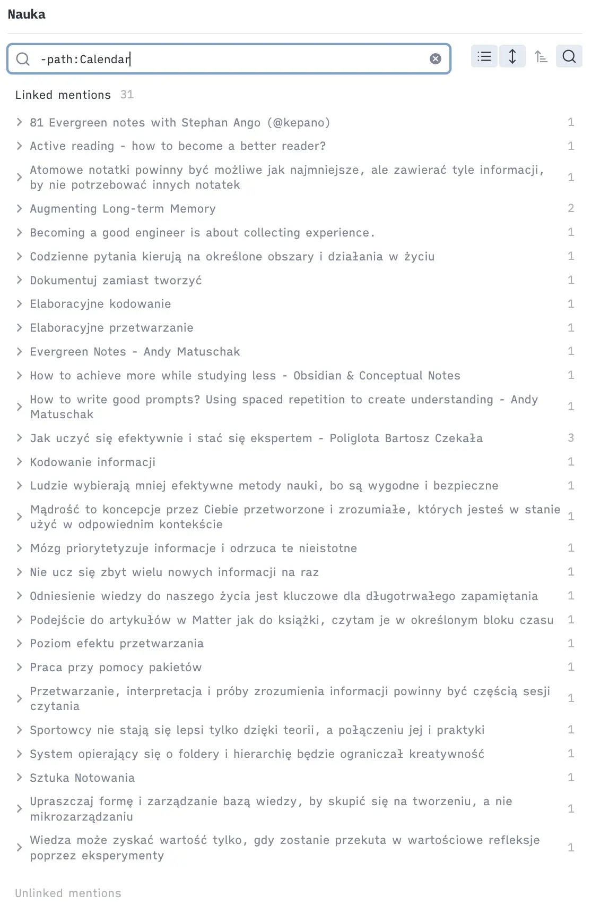

In the [previous article](/writing/how-i-use-obsidian-to-manage-mental-overload-in-fast-paced-tech-world), I described how using Obsidian helps me manage information overload and work more effectively.

Today I'll share my approach to structuring a note system to quickly and easily find needed notes.

The main goal of an effective note-taking system is how quickly and easily you can locate notes later on. This is why I strive to create a system that serves as a "cache" of knowledge, enabling me to find solutions to problems more efficiently.

I use the following principles to maintain an effective yet simple system.

1. Write notes as messages to my future self.
2. Focus on connections instead of hierarchy.

## Write notes for future self

To efficiently find and reuse information, I write notes from a future perspective—considering how I will retrieve them. Spending a few extra seconds to answer the questions below saves much more time later.

- Is this linked to a project, technology, person, or team? What contexts help me find the note?
- Why will I need this note in a few weeks?
- When will it speed up my work?

### Engineering problems, solutions and insights

For example, the first time I used `jest-e2e` (internal tool for running E2E tests), I struggled to understand why a test had failed. I spent an hour trying to figure it out, only to discover that a missing feature flag setting was causing the wrong branch to run. To prevent wasting time on this issue again, I created a note titled _"If E2E is broken, be sure the right Feature Flag is set up_" to describe the problem and the solution. I linked this note to others titled _"Jest-E2E"_ and _"Feature Flag"_.

Another example is a tricky bug related to [Relay](https://relay.dev/), where the cache was misused. To identify the root cause, I had to dive deep for a few hours, as it initially seemed like caching was the obvious issue. The correct solution turned out to be refreshing multiple connections.After fixing the bug, I wanted to ensure I left a guide for myself and others to navigate a similar process more efficiently in the future. To accomplish this, I took detailed notes documenting the problem and solution, such as _"Relay allows refreshing multiple connections, use it instead of cache"_ and _"Be cautious with cache invalidation for Relay"_ I linked all of these notes to a central "Relay" reference for easy access.

Keywords like "Relay," "Jest-E2E," or "GK" serve as **hubs**, grouping related insights, problems, and solutions around a specific keyword or concept. Thanks to the backlinks feature in Obsidian, I can easily see all references to a particular keyword across my entire database. 

> TODO: Add example of hubs from Vault

The benefit of this approach?

When I next encounter a weird end-to-end test or Relay problem (or just want to explain these topics to others), I can easily access all related notes by visiting the hub-note (or keyword-note if you prefer). The note itself can remain empty; the backlinks are what truly matter. This "cache" helps me resolve similar problems more efficiently.

Below is another example from my private vault that displays all references to the keyword "Learning" that I created over time.

### Projects and meetings

Similarly, you can create notes on a specific project or initiative to easily keep all related information. For example, during a meeting, you can quickly jot something down and add `[[ProjectX]]` to easily refer to it. Obsidian allows you to filter backlinks, e.g., you can filter references that are meetings. This is especially useful for double-checking a decision made in “some meeting in the past” about Project X.

## Scaling the system

A system based on connections is super easy to grow and scale organically. If you have a lot of notes for testing and feel you need better navigation, you can build an “abstraction” for it, another level. Just put your “keyword notes” like “WWW Testing” and “Jest-E2E” under more generic term like “Testing”. It allows you to go through the nodes top-down or bottom-up.

## Connections, tags and folders

### Connections

As you can see, it's important for my system to rely on connections. I try to avoid strict hierarchies. A hierarchical structure requires everything to be in one place, but notes often cover several ideas. They can be connected to multiple keywords. Also, finding a note after weeks of creating it is easier if the note is connected to multiple different nodes. I have multiple different paths to reach the note.

If I were to add a note about a certain decision made by "X" and "Y" related to "Project X" during "Meeting A," I would have 4 different starting points. This makes finding this information much easier.

### Tags

I use tags as attributes describing notes or bullet points in daily notes. They are additional metadata I can use to filter relevant information. If you think about a note like an object storing information tags describing this object (type, status, date) Typical tags I use are `#type/meeting`, `#type/article`, `#type/podcast` `#flashcard` `#todo`, `#💡`.

### Folders

I use folders mostly to maintain backward compatibility and integrate my notes with other systems, e.g., terminal, iOS, excluded folders, Obsidian Sync, and Cursor Editor. As I mentioned, I avoid hierarchy and keep the folder structure as flat as possible. Thanks to connection-based organization and the advanced search offered by Obsidian, I don't feel the need for any precise structure.

---

This structure gives me confidence to safely store information and find it later. It has helped me reduce information overload, and I hope these ideas help you create your own system.