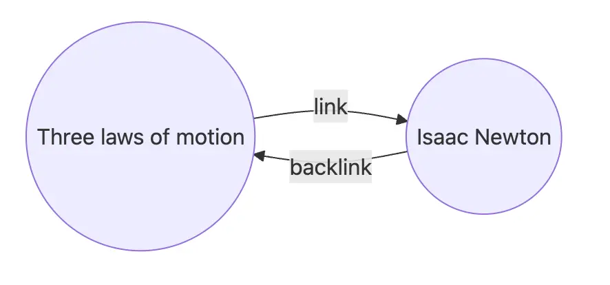
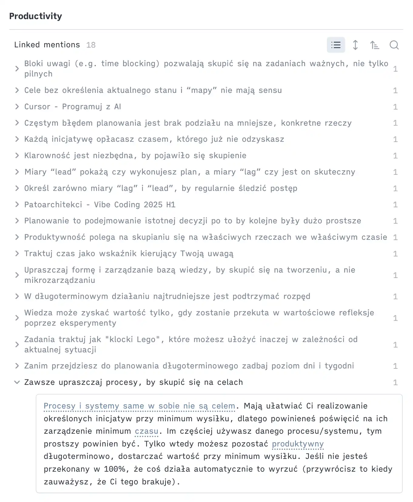

I’ve been working as a Software Engineer for almost a decade now. In the tech world, things move fast, and we’re constantly bombarded with more and more information. Too often, we tell ourselves, “I’ll remember it” or “I’ll keep it in my head.”

But the truth is, our brains can only hold so much.

## The Brain is a CPU, not a Storage Disk

In the past, I often used to overestimate my capacity to retain information; I was usually able to manage less than I thought. Whenever I exceed this limit, I start to feel overwhelmed. This leads to problems with focus, entering a flow state, and moving on to the next task. Often, my procrastination increases as well.

Our brains function more like CPUs, designed for analyzing information, connecting dots, and engaging in creative thinking. When we overload them with too much information, we diminish their capacity for these critical processes.
And "too much" is not really much; we can manage about seven “chunks” of information in our minds at any given time. [Research paper](https://bpb-us-e1.wpmucdn.com/wp.nyu.edu/dist/0/1503/files/2015/08/The_Magical_Number_Seven.pdf?bid=1503)

Fortunately, there’s a simple way to help your brain and reduce overload: an external storage system. For me, this takes the form of journaling in Obsidian.

## External Storage System

I put literally anything in there.

- Have important tasks for the day? I place them at the top of my daily note, ensuring they’re always visible and helping me narrow my focus.
- Need to implement new functionality? I start by outlining a step-by-step plan. This practice consistently enhances the quality of my code and the abstractions I create—it's like having a rubber duck to talk through my thoughts.
- Encounter a tricky spot, obstacle, problem, or hard-to-debug issue? I jot down a quick note to make sure I can reuse that information later. Think of it as the DRY (Don’t Repeat Yourself) principle applied to notes and knowledge!
- Finishing a work session or switching to another initiative? I do a brain dump before the switch. This clears my mind before moving on and provides a seamless transition for my future self to pick up where I left off.
- Learn a clever trick or a new technology that might be useful later? I leave a note for my future self to expedite the process when I need it again.

I’m aware of the limited capacity of my brain, and throughout the day, I try to avoid reaching its upper limit.

> "The competent programmer is fully aware of the limited size of their own skull. They, therefore, approach their task with full humility and avoid clever tricks like the plague."
>
> \- Edsger Dijkstra

## Writing - Tool for Thinking

Some might say I spend too much time writing and that it’s a waste of time when I could be doing something else and “just working.”

> "Notes aren’t a record of my thinking process. They are my thinking process."
>
> \- Richard Feynman

Fair point, but let me explain my perspective. 

I’m a Software Engineer, a knowledge worker. My expertise lies in solving abstract problems and thinking critically, and writing is a great tool for thinking. If you’re not able to clearly list the steps of your functionality, how do you plan to implement it clean way? Writing is not the goal in itself; **it’s a tool that supports thinking and declutters my mind.**

## Add a Cache Layer to Your Knowledge

I mentioned that I use DRY for my knowledge and try to reuse concepts or notes I’ve already put in my system. But how can I be sure I can find them quickly? Just use connections.

In Obsidian, you can easily refer to other notes by using double square brackets `[[...]]`. This creates links from the source note to the note you refer to, and even more importantly, it creates a backlink. For me, this is the most powerful concept in [Obsidian](https://help.obsidian.md/plugins/backlinks).

Why?

**You'll build your personal insights for certain concepts without additional effort.** It’s like a cache for your knowledge. Next time you face a problem related to concept X, you can just go to this note (note can by empty itself) and find all references among all notes. It has sped up my work significantly. [Backlinks are the most powerful tool for knowledge base.](/writing/backlinks-are-the-most-powerful-tool-for-knowledge-base)

Look at the example below. Here are all references to "Productivity" in my knowledge base. When I need to refer to this concept in the future, I can easily find related information.

Another trick that ensures I can easily find the notes is **writing for my future self as if I were a different person at a different time**. That person might not have the knowledge and context I have today, so I must provide enough context and information for that person to have the full picture. [Write to future self.](/writing/write-to-future-self)

You can use the following questions:
- Under what contexts would I like to find it in the future? Would it be related to feature A, project B? Is it frontend or backend stuff?  
- In a few weeks, or a few months, or even a year or more, when I come back to this note, what do I know now that will be useful then?

## KISS Principle

I use Obsidian as my tool for note-making, even though I’ve tested a bunch of others like Tana, Notion, and LogSeq. So far, nothing beats Obsidian for me. It offers local support, a great community, lots of plugins, and customization possibilities.

However, the last point can be a trap, especially if you’re a perfectionist. You might want to create the perfect note-taking system that covers all cases immediately. I’ve been there, and I don’t recommend it.

Your daily system should follow one simple rule **KISS (Keep It Simple, Stupid)**. It should be super simple, with zero friction to use it. Even though I’ve used Obsidian for over four years, I try to rely on just a few plugins. Thanks to that, I focus not on working on my system but on the content—the real value from the system.
