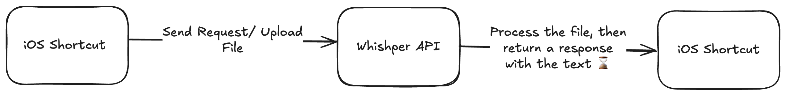
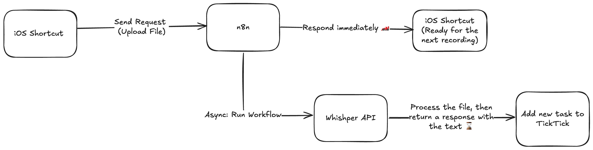
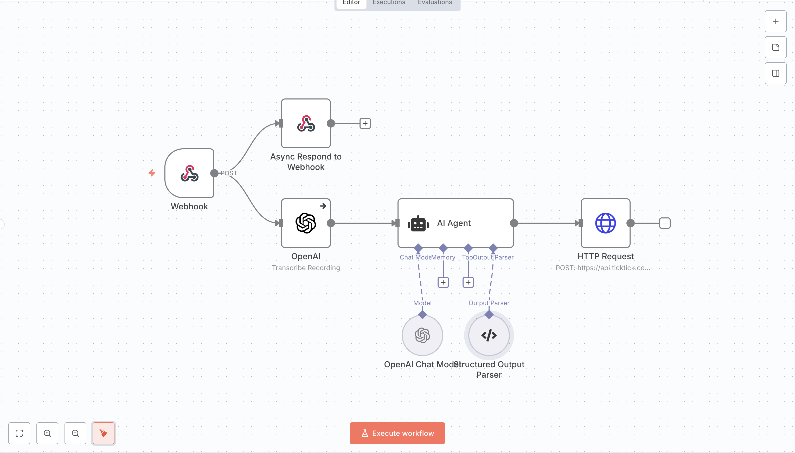
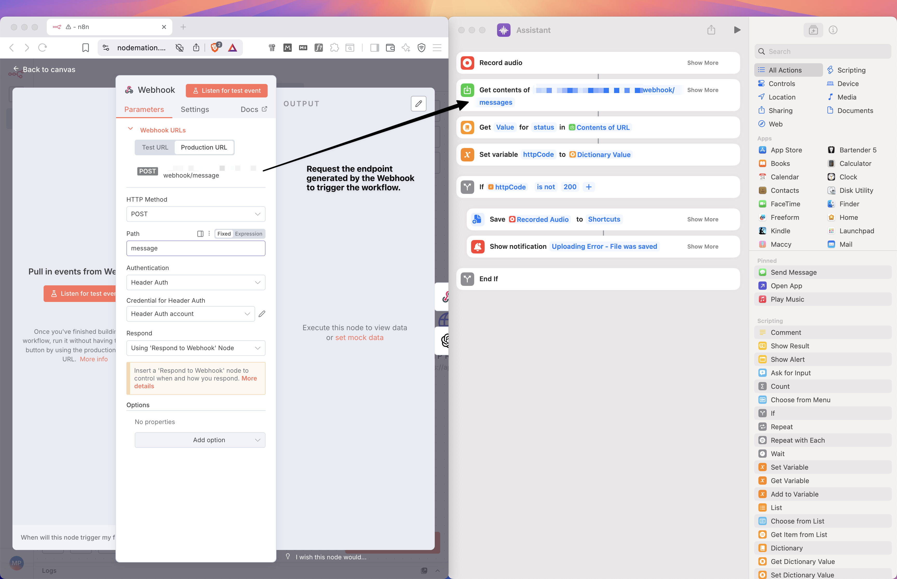

Have you ever noticed that your best ideas often come when you least expect them? Maybe while you’re out for a run, in the middle of a gym session, or even when you’re deeply focused on a different task at work. These creative moments seem to appear out of nowhere — often at the most inconvenient times.

For a long time, I struggled with what to do in these situations.

I tried to write my thoughts down right away, but sometimes there were just too many at once, or my ideas were too long to capture quickly.
As a result, I would forget some of them, or get frustrated when I had to interrupt my current work just to take notes. However everything has changes when AI came in.

## Use voice to capture ideas instantly

AI is transforming creative work, making once-complex tasks simple (not, shit Sherlock). In my case, with OpenAI Whisper, turning voice notes into text is effortless—just connect it to your system (like iOS), and it handles everything.

I wanted a seamless way to capture thoughts on my Apple devices. Thankfully, Apple Shortcuts lets you automate and trigger actions, especially for capturing voice on iPhone or Apple Watch.

With an API-based solution, it’s easy—just use “Get contents of URL" in Shortcuts to send your request.

## Sync Solution - iOS Shortcuts

Initially, I started by putting everything into iOS Shortcuts. It was quite simple to set up—just get the OpenAPI Token, send the request, wait for the answer, and voila! I get the thought in written form. At this point, I can do whatever I want with the text, run another Shortcut, or pass it into a different application.

It’s a type of synchronous approach: send the request, wait, and receive the response in the same place you sent the request. It’s really convenient and simple; you control the whole flow in one place, and you can adjust and tweak the output in the next steps.

Despite all these advantages, time was a major blocker for me. When trying to capture voice on the Apple Watch, it took ages. That’s why I decided to make it asynchronous using [n8n](https://n8n.io/).

## Async Solution - iOS Shortcuts + n8n

One of my primary assumptions was to be able to quickly capture multiple, independent thoughts. In the previous synchronous approach, I had to wait for each flow to complete, which involved waiting for the request to the OpenAI API. Such a waste of time! 

Instead, I just capture the voice, create a file, send the request, and forget about it. The rest is processed in the background, asynchronously, allowing me to record the next thought.

To allow uploads from different places, I used a [Webhook](https://docs.n8n.io/integrations/builtin/core-nodes/n8n-nodes-base.webhook/) node that confirms the audio file upload in the first step. The Webhook offers an endpoint URL where you can upload your file to trigger the workflow. I integrated this functionality with "iOS Shortcuts" using the "Get Contents of URL" action, similar to my previous automation. 

This automation utilizes an [AI Agent](https://docs.n8n.io/integrations/builtin/cluster-nodes/root-nodes/n8n-nodes-langchain.agent/) node with a custom prompt for creating a task from the transcript. I also ensured that the output is formatted to align with the TickTick API by using the [Structured Output Parse](https://docs.n8n.io/integrations/builtin/cluster-nodes/sub-nodes/n8n-nodes-langchain.outputparserstructured/).

However, this asynchronous approach has a few caveats.

I have less control over what’s happening; I can't simply manage it in Shortcuts. Also, in n8n, I have to control the entire process, including the endpoint (TickTick in my case). In the previous approach, I just received the text, which I could use in further steps.

Regarding error handling in the asynchronous approach, I need to inform myself about potential workflow problems asynchronously. I did this using Slack with a chatbot.

[Add the shortcut to your Apple Watch face for quick access.](https://www.youtube.com/watch?v=I3RoUJ8WYlE&ab_channel=FacultyofApps)

---

Time is a precious gift that you can't get back, so don't waste it on repetitive tasks - automate them.

AI and tools like n8n make creating an "army of robots" much easier than it was 2-3 years ago. Additionally, automation is no longer just nice-to-have; it’s a valuable skill that can make you stand out in the job market.